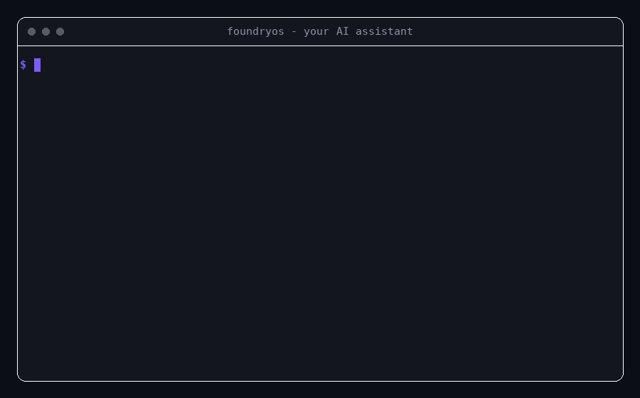

# FoundryOS

[](LICENSE) [](VERSION.md) [](CONTRIBUTING.md) [](CODE_OF_CONDUCT.md)

**Build Anything. Think Like a Team.**

*Open Source Agentic Operating System*

**One prompt in, one coherent cross-functional answer out.** Drop FoundryOS into any AI assistant that can read files, type `/gtm`, `/prd`, `/robotics`, or `/brand`, and it runs the right specialists — CPO, CTO, CIO, CFO, CRO, CBO, and more — in the right order, then merges their output into a single executive answer instead of ten disconnected ones. No install, no API keys, no lock-in — it's markdown, and it works the moment you point your assistant at the repo.

---

## See It In Action



*(Real terminal recreation of an actual run — same command, same output, just typed live instead of a static block. It plays out inside whatever AI assistant you already use; see [Supported Environments](#supported-environments) below. Full asset spec: [`docs/SHOWCASE.md`](docs/SHOWCASE.md).)*

<details>
<summary>Prefer plain text? Same run, no GIF.</summary>

```
$ You:  /gtm Launch a usage-based pricing SaaS product to mid-market teams.

Meta-Agent Result
──────────────────────────────────────────────────────────────
1. Request Classification   Revenue / Go-to-Market
2. Selected Agents          CPO-Agent → CRO-Agent → CMO-Agent
3. Selected Skills          08-gtm-skill, 36-pricing-sales-skill,
                             03-strategy-skill, 37-marketing-skill
4. Combined Executive Answer
   → Positioning, channel mix, pricing tiers, and launch sequence,
     written as one plan — not three separate agent outputs
5. Contradictions/Conflicts  None identified
6. Missing Inputs/Assumptions
   → Assumed B2B sales-assisted motion; flag if self-serve
7. Risks & Next Actions      [specific, dated, ready to execute]
──────────────────────────────────────────────────────────────
✓ One coherent answer, assembled from 3 specialists, in one pass.
```

</details>

## Quick Win: 60 Seconds to a Real Output

1. Drop this repo into Claude, ChatGPT, Cursor, or Windsurf (see [Quick Start](#quick-start) below).
2. Type one line: `/prd Write a PRD for a usage-based billing feature.`
3. Get back a structured PRD — problem statement, ICP, requirements, and scorecard — produced by CPO-Agent's `04-prd-skill`, with assumptions flagged instead of silently guessed.

That's the whole workflow. No config file, no onboarding flow, no account. See [`examples/`](examples) for nine fully worked runs across AI products, robotics, SaaS, fundraising, manufacturing, team scaling, and brand/identity.

---

## Why FoundryOS

- **Multi-agent by default.** Real requests cut across domains; one generalist persona covering everything shallowly is the old way. FoundryOS runs the right specialists in the right order automatically.
- **One coherent answer, not ten.** The Meta-Agent merges multi-agent output into a single voice and explicitly surfaces contradictions and missing inputs — most multi-agent setups leave that stitching to you.
- **Brand built in, not bolted on.** A full Brand Operating System — strategy, naming, identity, design system, voice — runs through CBO-Agent and attaches to every Workflow, not a standalone "marketing" afterthought.
- **Memory that compounds.** The Advanced Layer means the system gets measurably better at a given kind of decision the second time, not just the first.
- **Zero install, zero lock-in.** It's markdown. Works anywhere an AI assistant can read files; nothing to run, build, or host — and nothing to migrate away from later.

**Who it's for:** founders who want a structured starting point instead of a blank page; engineers and technical leads who need a CTO/CIO-level second opinion without hiring one yet; product managers who want PRDs, scorecards, and roadmaps in a consistent format; researchers and builders prototyping something new who need the right specialist framing without context-switching between five different mental models; teams who need a name, a logo, a voice, or a design system and don't yet have a CBO to ask; and teams who want their AI assistant to think like a full cross-functional org instead of one generalist.

**Where it stacks up against the alternatives:**

| Approach | What you actually get |
|---|---|
| One generalist prompt | A single shallow pass across every function at once — no specialist depth, nothing flags what's missing |
| Hand-chaining specialist prompts yourself | Real per-function depth, but you own the classification, sequencing, and merging, from scratch, every single time |
| **FoundryOS** | The Meta-Agent classifies the request, sequences the right specialists, and merges their output into one answer — contradictions and missing inputs surfaced, not buried |

**Where it's headed next:** v4.1 added a decision-modeling reasoning layer for ambiguous, non-artifact requests; **v5.0.0-preview.1** (current) adds a declarative MCP layer — a Skill can now name a specific live-data need instead of guessing silently. It's a pre-release toward the full v5.0.0 major, not the complete thing: a Runtime and an Execution Engine for closed-loop, unattended execution remain planned. Full detail in [Roadmap](#roadmap) below.

## Worked Examples

Nine fully worked, end-to-end runs — not toy snippets — showing exactly what comes out the other side:

| Example | Scenario | Agents Involved |
|---|---|---|
| [`ai-product-example.md`](examples/ai-product-example.md) | Shipping an AI product feature | CPO, CTO, CEO |
| [`robotics-product-example.md`](examples/robotics-product-example.md) | Designing a robotics product from scratch | CIO, CTO, CPO, COO |
| [`saas-dashboard-example.md`](examples/saas-dashboard-example.md) | Architecting a SaaS analytics dashboard | CTO, CPO, CMO |
| [`investor-readiness-example.md`](examples/investor-readiness-example.md) | Getting fundraising-ready | CEO, CFO, CPO, CRO, CTO |
| [`manufacturing-plan-example.md`](examples/manufacturing-plan-example.md) | Building a hardware manufacturing readiness plan | CIO, COO, CFO |
| [`team-scaling-example.md`](examples/team-scaling-example.md) | Designing org structure, hiring system, and culture at 15 people | CEO, COO, CHRO, CBO, CFO |
| [`brand-identity-example.md`](examples/brand-identity-example.md) | Building a brand, name, logo, and design system from zero | CEO, CBO |
| [`brand-narrative-community-example.md`](examples/brand-narrative-community-example.md) | Website, launch narrative, and community for an open-source launch | CBO, CRO |
| [`decision-modeling-example.md`](examples/decision-modeling-example.md) | Three worked decisions (AI inference hosting cost trade-off, SaaS pricing tier, manufacturing inspection automation) | CEO, CTO, CFO, COO |

See [`docs/EXAMPLES.md`](docs/EXAMPLES.md) for the indexed guide, or jump straight to [Quick Start](#quick-start) below to run one yourself.

---

## Architecture

```
179 Modules
      ↓
 59 Skills
      ↓
 10 Agents
      ↓
 1 Meta-Agent
      ↓
 11 Workflows
      ↓
 Memory
      ↓
 Reflection Agent
      ↓
 Critic Agent
      ↓
 Planner Agent
      ↓
 Knowledge Graph
      ↓
 Brand Intelligence
      ↓
 41 Commands
      ↓
 MCP Layer
      ↓
 Artifacts
```

This is the layer inventory — what exists, bottom-up. Three things worth being precise about:

The actual runtime loop those middle five (Memory → Reflection → Critic → Planner → Knowledge Graph) run in is slightly different and is documented precisely in [`ADVANCED_LAYER.md`](ADVANCED_LAYER.md): Memory feeds the Planner, the Planner's roadmap executes, Reflection writes the outcome back into Memory, and the Critic checks new plans against Memory before they ship — the Knowledge Graph is the map of all of it, not a step in the sequence.

**Brand Intelligence is not a separate add-on bolted onto the end** — it's CBO-Agent's Skills, Memory files, and Artifacts woven into every layer above it (see [`brand/BRAND_OS.md`](brand/BRAND_OS.md) and [`knowledge-graph/BRAND_GRAPH.md`](knowledge-graph/BRAND_GRAPH.md)). It's listed as its own stripe in this diagram only because the Knowledge Graph layer needed an explicit name for "where brand connects everything else," not because brand work happens in a separate phase after the rest of the system has already run.

And the diagram ends at **Artifacts**, not Commands — Commands are how you trigger the system, Artifacts are what you actually walk away with (a PRD, a BOM, a financial model, a Brand Strategy Brief). Earlier versions of this diagram stopped at Commands, which described the entry point but not the output; see [`knowledge-graph/ARTIFACT_GRAPH.md`](knowledge-graph/ARTIFACT_GRAPH.md) for how Artifacts map back to the Workflows and Agents that produce them.

**Modules** are the atomic layer — 179 self-contained units of domain knowledge (e.g. `01_Discovery_OS`, `35_AI_Architecture_OS`, `42_Regulatory_OS`, `58_Brand_Roadmap_OS`, `176_Solution_Formula_OS`), numbered `00`–`177` with one legacy duplicate at `99` (flagged in [`AUDIT_REPORT.md`](AUDIT_REPORT.md)). Modules are never called directly; they're the raw material Skills are built from.

**Skills** (59) are reusable capabilities, each compiled from 3–12 Modules — `04-prd-skill`, `31-ai-architecture-skill`, `41-mechatronics-skill`, `46-logo-system-skill`. Every Skill has a defined input, source Modules, and output (see [`registry/SKILL_REGISTRY.md`](registry/SKILL_REGISTRY.md)). Seventeen of the 59 (`42` through `58`) are CBO-Agent's brand domain; one, `59-problem-solving-decision-modeling-skill`, is a cross-cutting reasoning engine (owned by CEO-Agent) rather than a domain — it frames a problem, builds a causal/metric model, and selects reusable quantitative formulas for a decision, and combines with whichever domain Skill(s) that decision touches instead of replacing them.

**Agents** (10) are C-suite-shaped owners of a cluster of Skills — CEO, CPO, CTO, CIO, COO, CFO, CRO, CMO, CBO, CHRO (see [`registry/AGENT_REGISTRY.md`](registry/AGENT_REGISTRY.md)). One Skill, `35-npi-manufacturing-skill`, is intentionally co-owned by CIO-Agent and COO-Agent because hardware NPI genuinely sits at the intersection of engineering and operations. CBO-Agent (Chief Brand Officer) sits directly after CPO-Agent in the default execution order, attaching name, voice, and visual identity to a product before anyone builds or sells it.

**Meta-Agent** (1) reads a request, classifies it, decides which Agent(s) and Skill(s) should run, sequences them, and merges their output into one executive answer — flagging contradictions and missing inputs instead of guessing silently. It auto-activates CBO-Agent on any request that signals brand, identity, naming, logo, tagline, voice, design system, community, or visual-identity intent, even if the word "brand" never appears, and combines `59-problem-solving-decision-modeling-skill` into any request that's actually a decision ("should we," "which option," "is this worth it") rather than a request for a known artifact. Full spec: [`meta-agent/META_AGENT.md`](meta-agent/META_AGENT.md).

**Workflows** (11) are named, reusable sequences for the most common request shapes — new product, SaaS, hardware, AI, robotics, fundraising, GTM, company building, hiring, strategic planning, and problem solving/decision modeling. CBO-Agent runs inside the original 10 by default in 9 of them (`09-hiring-workflow` treats it as conditional); the 11th, `11-problem-solving-decision-workflow`, is the reasoning layer those ten call into at their own decision gates and can also run standalone. See [`workflows/`](workflows).

**Advanced Layer** — Memory (13 persistent files: 7 cross-domain, 6 brand-specific), Reflection Agent, Critic Agent, Planner Agent, and a Knowledge Graph (6 files, including [`BRAND_GRAPH.md`](knowledge-graph/BRAND_GRAPH.md)) — lets the system accumulate context and self-critique across runs instead of starting from zero each time, including brand consistency, voice consistency, and narrative quality. Full explanation: [`ADVANCED_LAYER.md`](ADVANCED_LAYER.md).

**Commands** (41) expose every Agent, Workflow, and Advanced-Layer component as a short slash command — `/cpo`, `/saas`, `/critic`, `/fundraising`, `/brand`, `/logo`, `/voice`, `/solve`, `/mcp`. A command is a pointer into logic that already exists; it adds no new behavior. See [`COMMANDS.md`](COMMANDS.md).

**MCP Layer** (new in v5.0.0-preview.1) sits between Commands and Artifacts as a declaration contract, not a runtime: any Skill whose output would be meaningfully better with a live external fact — current competitor pricing, what's actually in an existing codebase — can append an MCP Tool Request (Need / Category / fallback) instead of guessing silently. FoundryOS still executes nothing itself; whichever MCP-capable assistant is running the session fulfills the request, or the Meta-Agent's existing Missing Inputs/Assumptions handling absorbs the gap. This is deliberately the smaller half of the planned v5.0.0 major — a Runtime and an Execution Engine for unattended, closed-loop execution remain unshipped. Full spec: [`mcp-layer/MCP_LAYER.md`](mcp-layer/MCP_LAYER.md); how it connects to Commands and Artifacts: [`knowledge-graph/MCP_GRAPH.md`](knowledge-graph/MCP_GRAPH.md).

**Artifacts** are the concrete deliverables a run produces — PRD, System Architecture, BOM, Financial Model, GTM Plan, Roadmap, Brand Strategy Brief, Logo System, Design System, and so on. Every Artifact traces back to the Workflow and Agent(s) that produced it; see [`knowledge-graph/ARTIFACT_GRAPH.md`](knowledge-graph/ARTIFACT_GRAPH.md).

---

## More Features

- **Reusable Workflows.** The 11 most common request shapes are pre-sequenced so they don't have to be re-derived from scratch every time.
- **Slash commands everywhere.** 41 commands give you a fast, explicit way to invoke any Agent, Workflow, or Advanced-Layer component.
- **Fully generic templates.** No placeholder company, product, or example-brand names baked into the system — every template is written to be reused as-is for whatever you're actually building.

(See [Why FoundryOS](#why-foundryos) above for the headline differentiators.)

## Supported Environments

| Environment | Slash commands | Setup guide |
|---|---|---|
| Claude (Projects) | Via instruction | [`docs/CLAUDE_SETUP.md`](docs/CLAUDE_SETUP.md) |
| Claude Code | Native | [`docs/CLAUDE_SETUP.md`](docs/CLAUDE_SETUP.md) |
| ChatGPT (Projects / Custom GPT) | Via instruction | [`docs/CHATGPT_SETUP.md`](docs/CHATGPT_SETUP.md) |
| Cursor | Via `.cursorrules` | [`docs/CURSOR_SETUP.md`](docs/CURSOR_SETUP.md) |
| Windsurf | Via `.windsurfrules` | [`docs/WINDSURF_SETUP.md`](docs/WINDSURF_SETUP.md) |
| Any other agentic environment with file access | Via instruction | Follow the Claude Projects pattern |

---

## Quick Start

1. Download and extract the repository — see [`INSTALL.md`](INSTALL.md).
2. Point your assistant at it using the setup guide for your environment (table above).
3. Run a command:

   > `/startup Help me go from idea to a fundable, buildable plan for [your idea].`

See [`GETTING_STARTED.md`](GETTING_STARTED.md) for the 30-second / 5-minute / 30-minute onboarding paths, and [`QUICKSTART.md`](QUICKSTART.md) for how the Meta-Agent's plain-English routing works if you'd rather not use a command.

## Commands

41 slash commands cover every Agent, Workflow, and Advanced-Layer component — `/cpo`, `/cto`, `/cio`, `/coo`, `/cfo`, `/cro`, `/cmo`, `/chro`, `/ceo`, `/planner`, `/critic`, `/reflection`, `/mcp`, `/prd`, `/gtm`, `/fundraising`, `/startup`, `/company-builder`, `/saas`, `/hardware`, `/robotics`, `/ai-product`, `/strategy`, `/market`, `/finance`, `/architecture`, `/operations`, `/solve`, `/brand`, `/logo`, `/naming`, `/tagline`, `/story`, `/design-system`, `/identity`, `/community`, `/website`, `/copy`, `/voice`, `/colors`, `/social-assets`. Full table and usage: [`COMMANDS.md`](COMMANDS.md).

### Claude Code slash commands

The `commands/` folder above is documentation — Purpose, Activated Agents, Activated Skills, Workflows, Output, Example — written for a human (or any assistant) to read and follow. `.claude/commands/` is the executable layer on top of it: 41 matching files, in Claude Code's native slash-command format, that ship pre-built in this repo. Open the repo in Claude Code and `/cpo`, `/robotics`, `/brand`, and the rest just work — no setup step.

Each generated file is a thin wrapper, not a duplicate. It instructs Claude Code to read the relevant Agent file(s) (and `meta-agent/META_AGENT.md` for multi-Agent commands) live off disk before answering, carries the full command spec inline, and points to the Meta-Agent merge pattern in [`QUICKSTART.md`](QUICKSTART.md#worked-example) for commands that activate more than one Agent. This keeps `.claude/commands/` honest as the system evolves — it reads the Agent/Meta-Agent files as they exist today rather than freezing a snapshot of their content at generation time.

`commands/` remains the source of truth. If you add a new command or change an existing one, run `python3 scripts/generate_claude_commands.py` to regenerate `.claude/commands/` to match — see [`docs/CLAUDE_SETUP.md`](docs/CLAUDE_SETUP.md#method-2-claude-code) for how the two folders relate, and [`CONTRIBUTING.md`](CONTRIBUTING.md#how-to-add-a-command) for the full add-a-command checklist.

---

## Folder Structure

```
FoundryOS/
├── README.md                    ← you are here
├── INSTALL.md                   ← download + extract, then pick an environment
├── QUICKSTART.md                ← plain-English routing, example prompts
├── GETTING_STARTED.md           ← 30-second / 5-minute / 30-minute onboarding
├── COMMANDS.md                  ← full command table
├── FAQ.md
├── CONTRIBUTING.md
├── CODE_OF_CONDUCT.md           ← Contributor Covenant v2.1
├── SECURITY.md                  ← vulnerability reporting process
├── .gitignore
├── .github/
│   ├── ISSUE_TEMPLATE/
│   │   ├── bug_report.md        ← inconsistency / broken reference
│   │   └── feature_request.md   ← new Skill / Agent / Workflow / Command proposal
│   └── PULL_REQUEST_TEMPLATE.md
├── .claude/
│   └── commands/                ← 41 pre-built Claude Code slash commands (generated from commands/)
│       └── {name}.md
├── ADVANCED_LAYER.md            ← how Memory/Reflection/Critic/Planner/Graph interact
├── VERSION.md                   ← current version + structural roadmap
├── VERSIONING.md                ← versioning policy: major/minor/patch, release & tag rules
├── CHANGELOG.md                 ← version history, file-by-file
├── RELEASE_NOTES.md             ← publish-ready summary per version, for GitHub Releases
├── AUDIT_REPORT.md              ← v4.0 release audit (detailed)
├── FINAL_RELEASE_AUDIT.md       ← consolidated audit, auto-fix report, and publish checklist
├── LICENSE                      ← MIT
├── docs/                        ← secondary & reference documentation
│   ├── TUTORIALS.md             ← beginner / intermediate / advanced
│   ├── ROADMAP.md               ← v1 → v5 and future vision
│   ├── SHOWCASE.md              ← GitHub showcase kit: diagrams, banner & screenshot prompts
│   ├── EXAMPLES.md              ← index into examples/
│   ├── CLAUDE_SETUP.md
│   ├── CHATGPT_SETUP.md
│   ├── CURSOR_SETUP.md
│   └── WINDSURF_SETUP.md
├── assets/                      ← rendered visuals once produced — see docs/SHOWCASE.md for specs
├── brand/                       ← brand/BRAND_OS.md — the Brand OS charter and how it threads through every layer
├── skills/                      ← 59 Skills, each compiled from a Modules cluster (17 are CBO-Agent's brand domain,
│                                   1 — `59-problem-solving-decision-modeling-skill` — is a cross-cutting reasoning layer)
│                                   (no standalone modules/ folder — 179 module files live inside skills/{NN}-{name}-skill/)
│   └── {NN}-{name}-skill/
│       ├── SKILL.md
│       └── (source module files)
├── agents/                      ← 10 C-suite Agents, each owning a Skills cluster
│   └── {Role}-Agent/
│       ├── AGENT.md
│       └── (copies of owned skill folders)
├── meta-agent/
│   └── META_AGENT.md            ← the orchestrator
├── workflows/                   ← 11 named, reusable multi-agent sequences (10 product/company-shaped + 1 reasoning layer)
│   └── {NN}-{name}-workflow/
│       └── WORKFLOW.md
├── memory/                      ← 13 persistent context files (7 cross-domain, 6 brand-specific)
├── reflection-agent/
│   └── REFLECTION_AGENT.md
├── critic-agent/
│   └── CRITIC_AGENT.md
├── planner-agent/
│   └── PLANNER_AGENT.md
├── knowledge-graph/              ← 7 dependency-map files (incl. ARTIFACT_GRAPH.md, BRAND_GRAPH.md, MCP_GRAPH.md)
├── mcp-layer/
│   └── MCP_LAYER.md              ← declarative MCP tool-request contract (v5.0.0-preview.1, spec only)
├── commands/                     ← 41 slash-command definitions
│   └── {name}.md
├── scripts/
│   └── generate_claude_commands.py  ← regenerates .claude/commands/ from commands/
├── registry/
│   ├── AGENT_REGISTRY.md        ← every Agent: mandate, skills, outputs, dependencies
│   └── SKILL_REGISTRY.md        ← every Skill: purpose, source modules, outputs, dependencies
├── examples/                     ← worked end-to-end runs
│   ├── ai-product-example.md
│   ├── robotics-product-example.md
│   ├── saas-dashboard-example.md
│   ├── investor-readiness-example.md
│   ├── manufacturing-plan-example.md
│   ├── team-scaling-example.md
│   ├── brand-identity-example.md
│   ├── brand-narrative-community-example.md
│   └── decision-modeling-example.md
└── tests/                        ← routing, agent-selection, and brand-consistency test specs
```

---

## Screenshots

The terminal side is covered by the [demo GIF](#see-it-in-action) at the top of this README. The rest is coming soon — this is a markdown-only system with no UI of its own, so "screenshots" beyond the terminal means it running inside each supported assistant's chat interface. Those mockups, banner, and demo-video specs are already written up in [`docs/SHOWCASE.md`](docs/SHOWCASE.md); once rendered they land in `assets/`. They'll show: a Claude Project with FoundryOS loaded, a `/cpo` command running in Claude Code, and a Meta-Agent Result rendered end to end inside a chat window. If you'd like to contribute one from your own setup, see [`CONTRIBUTING.md`](CONTRIBUTING.md).

---

## Roadmap

v1 shipped the core four layers (Modules → Skills → Agents → Meta-Agent). v2 added Workflows and the Advanced Layer. v3 added Commands and a full onboarding doc set. v4 is the FoundryOS rename, the `docs/`/`assets/` restructure, the Commands → Artifacts architecture fix, and a full Brand Operating System (CBO-Agent, 17 brand Skills, 6 brand Memory files, `BRAND_GRAPH.md`, and 13 brand Commands) integrated into every layer rather than appended as a tenth Agent that runs in isolation. v4.1 added a **Problem Solving and Decision Modeling** reasoning layer — `59-problem-solving-decision-modeling-skill` (CEO-Agent), a 29-formula reusable quantitative library, `11-problem-solving-decision-workflow`, and the `/solve` command — that frames ambiguous problems, builds causal and metric models, and selects the right quantitative formula for a decision instead of defaulting every request to a PRD.

**v5.0.0-preview.1** (current) adds the **MCP Layer** — a declaration contract, not a runtime: any Skill can now append an MCP Tool Request (Need / Category / fallback) naming a specific live-data need instead of guessing silently, fulfilled by whichever MCP-capable assistant is running the session. This is a pre-release tag toward the full v5.0.0 major, not the complete thing — see [`VERSIONING.md`](VERSIONING.md)'s new pre-release tag convention (§11). Still planned before the plain `v5.0.0` tag is cut: a **Runtime** (state held across Workflow steps) and an **Execution Engine** (steps that run in order, unattended, without a human re-prompting between each one) — together enabling autonomous, closed-loop workflows. Full detail: [`docs/ROADMAP.md`](docs/ROADMAP.md). Versioning policy — what counts as major/minor/patch, and why the public release is v4.0.0 rather than v1.0.0: [`VERSIONING.md`](VERSIONING.md). Per-version publish notes: [`RELEASE_NOTES.md`](RELEASE_NOTES.md). Full v4.0 audit: [`AUDIT_REPORT.md`](AUDIT_REPORT.md). Consolidated final audit, auto-fix report, and GitHub publish checklist: [`FINAL_RELEASE_AUDIT.md`](FINAL_RELEASE_AUDIT.md).

## Community

This is an open-source-ready knowledge system. Contributions that add Modules, propose new Skills, refine Agent mandates, or add a new command are welcome — see [`CONTRIBUTING.md`](CONTRIBUTING.md), and use the issue/PR templates under [`.github/`](.github) to propose one or report a broken reference. Questions are probably already answered in [`FAQ.md`](FAQ.md). Participation is governed by the [Code of Conduct](CODE_OF_CONDUCT.md); see [`SECURITY.md`](SECURITY.md) to report a vulnerability privately rather than via a public issue.

## License

MIT — see [`LICENSE`](LICENSE).
