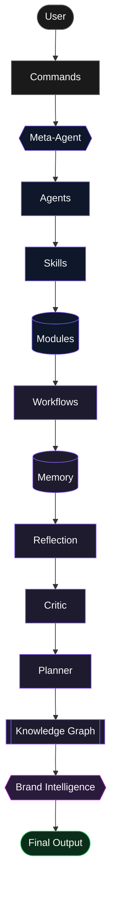

# Showcase Kit

Everything needed to make the GitHub repository page land in under five seconds: "I can use this." This file is a kit of specs and prompts, not rendered images — FoundryOS is a markdown-only system, so the actual PNGs/SVGs/GIFs get produced by feeding the prompts below into an image-generation tool (or by handing the specs to a designer) and committing the output under `assets/` (convention suggested in [Where These Go](#where-these-go)).

One distinction worth being explicit about: the diagram in [`README.md`](../README.md#architecture) is the **layer inventory** — what exists, bottom-up. The diagram in this file is the **request-flow view** — what happens, in the order a user experiences it, top-down from the moment they type a command to the moment they get an answer. Same system, two honest framings, used for two different jobs.

**Shared design language** (referenced by every prompt below so it isn't repeated nine times):

| Token | Value |
|---|---|
| Background | near-black charcoal, `#0B0E14` |
| Surface panel | dark slate, `#13161F`, 1px border at 8% white opacity, 10px corner radius |
| Accent (primary) | electric indigo, `#7C5CFF` |
| Accent (success) | `#22C55E` (completed states, checkmarks) |
| Accent (caution) | `#F59E0B` (risks, flagged assumptions) |
| Headline type | geometric sans-serif (Inter, Söhne, or equivalent) |
| Code / command type | monospace (JetBrains Mono, Berkeley Mono, or equivalent) |
| Logo mark | abstract node-graph glyph (a few connected dots/lines) — there's no existing logo, so generate one instead of leaving a text-only wordmark |
| Chrome | a **generic** dark chat/terminal interface — rounded window, no titlebar buttons, no real product's pixel-exact UI. FoundryOS runs inside other tools' interfaces; the mockups should not imply a screenshot of Claude, ChatGPT, Cursor, or Windsurf's actual UI |

One legal/practical note that applies everywhere below: don't reproduce Anthropic's, OpenAI's, GitHub's, Cursor's, or Windsurf's actual logos in any generated asset. Use plain text names ("Works with Claude · ChatGPT · Cursor · Windsurf") instead of their wordmarks or icons. Keeps the kit safely generic and avoids trademark issues for whoever ends up rendering and publishing these.

---

## 1. Architecture Diagram (Request-Flow View)

### Mermaid



Brand Intelligence is drawn as its own node rather than folded into Agents because it isn't a single Agent's output — CBO-Agent's Skills feed it, but so does every other Agent's run, since `memory/brand-memory.md` and the consistency check the Critic Agent runs both sit at this layer. Magenta (`#C026D3`) distinguishes it from the indigo "core" and purple "advanced" nodes without introducing a fourth unrelated hue.

### ASCII

```
   ┌──────────┐
   │   USER   │  types a command or a plain-language request
   └────┬─────┘
        ▼
   ┌──────────┐
   │ COMMANDS │  /cpo  /robotics  /gtm  ...  (or skip straight to Meta-Agent)
   └────┬─────┘
        ▼
   ┌────────────┐
   │ META-AGENT │  classifies → selects → sequences
   └────┬───────┘
        ▼
   ┌──────────┐
   │  AGENTS  │  CEO / CPO / CTO / CIO / COO / CFO / CRO / CMO / CBO / CHRO
   └────┬─────┘
        ▼
   ┌──────────┐
   │  SKILLS  │  the specific capabilities each Agent owns
   └────┬─────┘
        ▼
   ┌──────────┐
   │ MODULES  │  the atomic domain knowledge Skills are built from
   └────┬─────┘
        ▼
   ┌───────────┐
   │ WORKFLOWS │  the named sequence this request matched
   └────┬──────┘
        ▼
   ┌────────┐
   │ MEMORY │  prior decisions and outcomes, read before answering
   └────┬───┘
        ▼
   ┌────────────┐
   │ REFLECTION │  did the last similar run's assumptions hold up?
   └────┬───────┘
        ▼
   ┌────────┐
   │ CRITIC │  adversarial pass — risks, contradictions, gaps
   └────┬───┘
        ▼
   ┌─────────┐
   │ PLANNER │  turns the answer into a dated, sequenced roadmap
   └────┬────┘
        ▼
   ┌─────────────────┐
   │ KNOWLEDGE GRAPH  │  the map of how all of the above connects
   └────┬─────────────┘
        ▼
   ┌────────────────────┐
   │ BRAND INTELLIGENCE │  is this answer consistent with the name, voice, and visuals already locked in?
   └────┬───────────────┘
        ▼
   ┌──────────────┐
   │ FINAL OUTPUT │  one coherent, multi-agent answer
   └──────────────┘
```

### PNG prompt

> A vertical-flow infographic on a near-black charcoal background (`#0B0E14`), minimal and premium — the visual register of Anthropic and OpenAI's own developer documentation, not a busy startup pitch deck. Thirteen labeled nodes — User, Commands, Meta-Agent, Agents, Skills, Modules, Workflows, Memory, Reflection, Critic, Planner, Knowledge Graph, Brand Intelligence — connected by a single glowing indigo line (`#7C5CFF`) that runs through all of them, with the Brand Intelligence node rendered in magenta (`#C026D3`) to set it apart as a cross-cutting check rather than a sequential step, and terminates at a fourteenth node, "Final Output," rendered in green (`#22C55E`). Each node is a rounded rectangle with a one-word label in a geometric sans-serif and a tiny abstract icon (no literal logos). Generous negative space between nodes — this should read as calm and confident, not crowded.
>
> Practical layout note: 13 nodes stacked in one strip is too tall for a README hero image. Lay it out as a 5-row × 3-column grid instead (User→Commands→Meta-Agent / Agents→Skills→Modules / Workflows→Memory→Reflection / Critic→Planner→Knowledge Graph / Brand Intelligence in the last row, alone, centered), connected by a numbered S-curve path so the top-to-bottom *order* still reads clearly, with "Final Output" as a centered closing node beneath the grid. Target canvas: 1600×1500, transparent or `#0B0E14` background.

### SVG prompt

> Same composition as the PNG prompt above, but specified for a vector tool or front-end developer to hand-build as inline SVG/HTML rather than generate as a raster image: 14 nodes as `<rect>` elements with `rx="10"`, stroke `#7C5CFF` (core layer) / `#8B5CF6` (advanced layer) / `#C026D3` (brand layer) / `#22C55E` (output) at 1.5px width, fill `#13161F`, connected by `<path>` elements with a 2px stroke and a subtle `<linearGradient>` from indigo to transparent to suggest directional flow. Labels in a monospace font at 14px, node width 160px, height 56px, 24px gap between rows. Deliver as a single `<svg viewBox="0 0 1600 1500">` so it scales cleanly inside a markdown README without a fixed pixel size.

---

## 2. GitHub Banner

**Spec:** 1280×640 (GitHub's own recommended social-preview size — see the note in [Social Preview](#7-social-preview-image), since this banner and that asset can share one source file).

> Dark, premium, minimal — Anthropic/OpenAI documentation aesthetic, not a gradient-heavy SaaS landing page. Background `#0B0E14` with a faint, low-opacity (8–12%) constellation of connected dots scattered toward the edges only, suggesting a knowledge graph without competing with the text. Centered composition, generous margins:
> - Top: a small abstract node-graph glyph (the logo mark)
> - Middle: **FoundryOS** in a large geometric sans-serif, white, bold
> - Below it, smaller and in a muted gray (`#9CA3AF`): **Open Source Agentic Operating System**
> - Below that, smallest, in indigo monospace: `Modules → Skills → Agents → Workflows → Brand`
>
> No other text. No screenshots, no UI chrome, no decorative illustration beyond the faint constellation. The restraint is the point.

---

## 3. README Screenshot Prompts

All four share one frame: a generic dark chat interface (rounded window, no real product's chrome) with a command typed at the top and a structured **Meta-Agent Result** rendered below it — the same nine-section shape documented in [`QUICKSTART.md`](../QUICKSTART.md#worked-example): Request Classification, Selected Agents, Selected Skills, Agent Execution Order, Combined Executive Answer, Contradictions/Conflicts, Missing Inputs/Assumptions, Risks, Next Actions. Render that structure as collapsible cards, not a wall of text — that's the actual visual hook: a messy multi-domain question becoming organized output. Canvas: 1920×1080 (16:9), dark UI per the shared design language above.

### Example 1 — `/cpo Build a SaaS startup`

> Command bar shows `/cpo Build a SaaS startup` in monospace with a small CPO-Agent badge (indigo). Below it, four result cards in a 2×2 grid: **Selected Agents & Skills** (CPO-Agent · Discovery, Market Sizing, PRD, Product Scorecard), **Roadmap** (a condensed 3-phase horizontal timeline), **PRD** (a scrollable card showing Problem Statement / ICP / Requirements headers, text truncated with a fade), **Metrics** (a small scorecard with 3–4 KPI tiles, e.g. activation rate, retention, NPS placeholders — generic numbers, not real benchmarks). A green "Generated in 1 pass" tag in a corner.

### Example 2 — `/robotics Design a warehouse robot`

> Command bar shows `/robotics Design a warehouse robot` with a multi-agent badge row (CPO · CIO · CTO · COO · CFO — five small indigo pills). Below it, five result cards: **Mechanical Architecture** (a simplified isometric robot wireframe icon, not a real CAD render), **Electronics** (a small block diagram: sensors → controller → actuators), **Embedded** (a code-adjacent card showing a firmware module list), **Manufacturing** (a horizontal NPI stage-gate strip: DVT → PVT → MP), **Roadmap** (timeline card). Layout: a 3-column masonry grid since five cards don't divide evenly into a clean grid otherwise.

### Example 3 — `/gtm Create a launch strategy`

> Command bar shows `/gtm Create a launch strategy` with CRO-Agent + CMO-Agent badges. Below it, four cards: **Channels** (a small horizontal bar chart comparing 4 generic channel types — paid, organic, partner, sales-led — placeholder values), **Messaging** (a card with a one-line positioning statement and 3 supporting bullets), **Pricing** (a 3-tier pricing card, generic tier names like "Starter / Growth / Enterprise"), **Metrics** (funnel visualization: Awareness → Consideration → Conversion → Retention, with a conversion-rate label at each step). 2×2 grid, same visual weight as Example 1 for series consistency.

### Example 4 — `/brand Define our naming and identity`

> Command bar shows `/brand Define our naming and identity` with a single CBO-Agent badge in magenta (`#C026D3`) instead of indigo, visually flagging this as the brand layer rather than a core domain Agent. Below it, four cards: **Archetype & Naming** (a card showing one chosen brand archetype, e.g. "The Pioneer," next to a shortlist of 3 generic placeholder names with one struck through and marked "trademark conflict — rejected"), **Positioning** (a one-line positioning statement card, same visual treatment as the Messaging card in Example 3 for series consistency), **Logo System** (a small grid of 3 abstract placeholder glyph variations — primary mark, monochrome, favicon-scale — not a finished logo, clearly labeled "concepts"), **Voice** (a small card listing 3 tone adjectives, e.g. "direct, technical, unhyped," plus one example banned phrase struck through). 2×2 grid, same dimensions as the other three examples so the four screenshots read as one consistent set when placed side by side in the README.

---

## 4. GIF Storyboard

10 seconds, 10 frames, ~1s each. Production note: screen-record a real session (terminal + a generic AI chat interface) rather than fully fabricating UI in a design tool — it'll look more credible and takes less effort than building 10 mockups from scratch. Capture with any screen recorder, trim and convert with `ffmpeg` or a GIF-specific tool (Kap, Gifski), keep it under ~3MB so it loads fast in a README.

| # | Frame | On-screen content | Caption |
|---|---|---|---|
| 1 | Terminal | `git clone https://github.com/<you>/FoundryOS.git` typed and run | — |
| 2 | File browser / upload dialog | Repository folder dragged into a generic AI assistant's project/upload panel | "Drop it into your AI assistant" |
| 3 | Chat input | User types `/cpo Build a SaaS startup` | — |
| 4 | Meta-Agent badge | A small "Meta-Agent: classifying..." indicator pulses in indigo | "Meta-Agent activates" |
| 5 | Agent badges | CPO-Agent badge appears (and CTO/CRO if multi-agent) with a brief highlight animation | "Agents selected" |
| 6 | Skill chips | 4–5 skill-name chips fade in under the agent badge | "Skills selected" |
| 7 | Roadmap card | A 3-phase roadmap card slides/fades into view | "Roadmap" |
| 8 | PRD card | A PRD card appears beside or below it | "PRD" |
| 9 | Metrics card | A small KPI scorecard appears | "Metrics" |
| 10 | Success card | All cards settle, a green checkmark and closing line appear | **"Built with FoundryOS"** |

**Brand-focused variant:** swap frame 3's command for `/brand Define our name, logo, and voice` and frame 5's badge for a single magenta CBO-Agent badge — same 10-beat structure, useful as a second GIF if the README wants to show the brand layer specifically rather than only product/technical work.

---

## 5. Demo Video Storyboard

30 seconds, 10 scenes, cinematic dark grade (slightly desaturated, high contrast, the look of a well-produced developer-tool launch video, not a corporate explainer). Suggested audio: a restrained, low-key synth/ambient bed with a soft transition "tick" on each scene cut — no voiceover needed if captions carry the narrative. Export at 1920×1080, H.264 mp4.

| Scene | Duration | Visual | Caption / on-screen text |
|---|---|---|---|
| 1 | 0:00–0:03 | GitHub repository page, slow push-in on the README header | "An operating system for founders." |
| 2 | 0:03–0:06 | Terminal, `git clone` command typed and executed | "Open source. No install." |
| 3 | 0:06–0:09 | Repository dragged into a generic AI assistant's project panel | "Works with the AI assistant you already use." |
| 4 | 0:09–0:13 | Chat input: `/robotics Design a warehouse robot` typed character-by-character | — |
| 5 | 0:13–0:17 | Agent badges cascade in: CPO → CIO → CTO → COO → CFO, each with a brief glow | "Five specialists. One answer." |
| 6 | 0:17–0:21 | Architecture diagram (from Section 1) builds itself node-by-node along the indigo line | "Mechanical. Electronics. Embedded." |
| 7 | 0:21–0:24 | Roadmap card expands into a dated, multi-phase timeline | "A dated plan, not a wall of text." |
| 8 | 0:24–0:26 | Green checkmark, "Built with FoundryOS" card | — |
| 9 | 0:26–0:28 | Quick cut to a GitHub repo page with a star counter animating upward (generic placeholder count, not a real claimed number) | — |
| 10 | 0:28–0:30 | Closing card: logo mark + "FoundryOS" + "Open Source Agentic Operating System" on `#0B0E14` | — |

**Note on Scene 5:** the CPO→CIO→CTO→COO→CFO cascade is specific to the robotics example carried through this storyboard. For a cut that foregrounds Brand OS instead, insert a CBO badge (magenta `#C026D3`, distinct from the indigo core-Agent badges) immediately after CPO — naming and positioning happen right after product definition, before architecture — with the caption changing to "Six specialists. One answer."

---

## 6. Commands Cheat Sheet

The condensed, at-a-glance version. For full Purpose / Agents / Skills / Workflow / Output detail on each, see [`COMMANDS.md`](../COMMANDS.md) and the individual files in [`commands/`](../commands).

| Command | Purpose |
|---|---|
| `/ceo` | Vision, governance, orchestration |
| `/cpo` | Product strategy, discovery, PRD |
| `/cto` | Software, data & AI architecture |
| `/cio` | Hardware & robotics design |
| `/coo` | Operations, supply chain, scaling |
| `/cfo` | Financial modeling, scenarios |
| `/cro` | Go-to-market, sales pipeline |
| `/cmo` | Demand gen, retention |
| `/cbo` | *(no dedicated file — use `/brand`, the CBO-Agent direct command)* |
| `/chro` | Hiring, org design, culture |
| `/planner` | Roadmap & critical path |
| `/critic` | Adversarial risk review |
| `/reflection` | Lessons learned |
| `/prd` | Product Requirements Document |
| `/gtm` | Go-to-market plan |
| `/fundraising` | Investor-ready package |
| `/startup` | Idea → fundable, buildable plan |
| `/company-builder` | Org structure & people systems |
| `/saas` | SaaS product, end to end |
| `/hardware` | Hardware product, end to end |
| `/robotics` | Robotics product, end to end |
| `/ai-product` | AI product, end to end |
| `/strategy` | Strategy, positioning, business model |
| `/market` | Market sizing & competitive landscape |
| `/finance` | Unit economics & P&L |
| `/architecture` | System / software / AI architecture |
| `/operations` | SOPs, risk register, execution plan |
| `/brand` | Brand strategy, archetype, naming, positioning |
| `/logo` | Logo system & mark concepts |
| `/naming` | Name generation & screening |
| `/tagline` | Tagline & one-liner options |
| `/story` | Brand narrative & origin story |
| `/design-system` | Color, type & component tokens |
| `/identity` | Brand book & visual identity governance |
| `/community` | Community structure & rituals |
| `/website` | Marketing site content & structure |
| `/copy` | On-brand copywriting |
| `/voice` | Tone of voice & banned-phrases list |
| `/colors` | Color psychology & palette |
| `/social-assets` | Social templates & avatar/banner kit |

The last 13 rows are the Brand Commands added in v4 — see [`COMMANDS.md`](../COMMANDS.md)'s "Brand Commands" table for the full Activated Agents/Skills detail on each.

---

## 7. Social Preview Image

**Spec note worth flagging:** GitHub's own recommended social-preview size is **1280×640** (minimum 640×320), uploaded under *Settings → General → Social preview* on the repository — it is not read automatically from a file in the repo. The commonly-cited **1200×630** is the generic Open Graph size used by Twitter/LinkedIn/Slack link unfurls for arbitrary websites. The two are close enough (same ~2:1 ratio) that one master file works for both — export the GitHub upload at 1280×640 and, if the README or a project site also needs an `og:image` meta tag, crop the same source to 1200×630.

> Same visual language as the GitHub Banner in Section 2 — dark `#0B0E14` background, faint constellation texture, centered composition: logo mark, **FoundryOS**, **Open Source Agentic Operating System**, and a row of small plain-text labels — `Modules` `Skills` `Agents` `Workflows` `Brand` — as minimal pill badges along the bottom, each in a thin indigo outline with no fill except the `Brand` pill, which uses a thin magenta (`#C026D3`) outline to match Brand Intelligence's color elsewhere in this kit. No GitHub logo, no AI-assistant logos; if "works with Claude · ChatGPT · Cursor · Windsurf" needs to appear, render it as plain text in the muted-gray tone, not as borrowed brand marks.

---

## 8. Logo Prompt

Every other asset in this kit references "the logo mark" as a given — this section is where it actually gets generated, once, and then reused everywhere else (banner, social preview, GIF closing card, demo video closing card). Generate this first; every other prompt above is downstream of it.

> A standalone abstract logo mark for "FoundryOS," an open-source agentic operating system. The mark: a small node-graph glyph — 4 to 6 connected nodes (filled circles, 3–5px radius) joined by thin straight lines, arranged asymmetrically so it doesn't read as a generic network-diagram clip-art icon or a literal org chart. One node should be subtly larger or filled in the accent indigo (`#7C5CFF`) while the rest are white or light gray — a single point of emphasis, not a uniform cluster, hinting at "one coherent answer assembled from many connected parts" without spelling that out literally. No wordmark, no text, no gradient, no 3D bevel, no drop shadow — flat, geometric, vector-clean, the kind of mark that still reads correctly at 16×16px favicon size. Background: transparent. Deliver at three scales: primary (512×512), monochrome single-color version for dark or light backgrounds, and a simplified favicon version (32×32) with fewer nodes if the full mark muddies at that size.
>
> Brand-system note: this is the same glyph the `46-logo-system-skill` and `57-brand-assets-management-skill` Skills produce conceptually when CBO-Agent runs `/logo` for an end user's own company — this prompt generates FoundryOS's *own* mark, not a template. Don't reuse this exact composition as a stock example inside the system's brand Skills; that would bias every user's generated logo toward looking like FoundryOS's.

---

## 9. Hero Images

Two larger illustrative images, distinct from the Architecture Diagram (which is informational) — these are mood-setting, used at the very top of the README above the fold and optionally on a project landing page.

### Hero 1 — "One coherent answer"

> A wide hero illustration (2400×1000) on `#0B0E14`. Left third: a scattered, slightly chaotic cluster of small gray text fragments and disconnected dots, suggesting nine or ten separate, unrelated answers — labeled faintly underneath, small and muted: "before." Right two-thirds: the same elements pulled into a single clean, organized vertical card stack (echoing the Meta-Agent Result cards from Section 3), glowing softly in indigo, labeled "after." A single thin indigo line sweeps left to right connecting the two halves, narrowing as it crosses the canvas — visually compressing chaos into order. No text other than the two small "before" / "after" labels — let the composition carry the meaning.

### Hero 2 — "Brand runs through everything"

> A wide hero illustration (2400×1000) on `#0B0E14`, structured as a cutaway/cross-section rather than a left-right split. A vertical stack of six thin horizontal bands (representing Modules, Skills, Agents, Workflows, Memory, Knowledge Graph) in muted slate gray, each band slightly transparent. A single magenta (`#C026D3`) ribbon weaves through all six bands at a slight diagonal, visibly passing *through* each one rather than sitting beside the stack — this is the visual argument for "brand isn't bolted on, it threads through every layer." At the bottom, the ribbon gathers into a small cluster of finished-looking outputs: a tiny logo mark, a tiny color swatch row, a tiny text snippet in a distinct typeface — concrete artifacts, not abstract icons. No labels needed if the composition reads clearly; if labels are added, keep them to the six band names in small monospace type along the left edge only.

---

## Where These Go

Once rendered, the convention this repo follows for everything else (markdown-only, nothing implied that doesn't exist yet) extends naturally to images:

```
FoundryOS/
└── assets/
    ├── banner.png              ← Section 2, README header
    ├── social-preview.png      ← Section 7, uploaded via GitHub repo Settings (not auto-read)
    ├── architecture-diagram.png  (or .svg)  ← Section 1
    ├── demo.gif                ← Section 4
    ├── demo-brand.gif          ← Section 4, brand-focused variant
    ├── demo.mp4                ← Section 5
    ├── logo/
    │   ├── logo-primary.png    ← Section 8, 512×512
    │   ├── logo-monochrome.png ← Section 8
    │   └── favicon.png         ← Section 8, 32×32
    ├── hero/
    │   ├── hero-one-answer.png      ← Section 9, Hero 1
    │   └── hero-brand-thread.png    ← Section 9, Hero 2
    └── screenshots/
        ├── cpo-saas.png        ← Section 3, Example 1
        ├── robotics-warehouse.png  ← Section 3, Example 2
        ├── gtm-launch.png      ← Section 3, Example 3
        └── brand-identity.png  ← Section 3, Example 4
```

Wire `banner.png` into the top of [`README.md`](../README.md) once it exists, and replace the "Coming soon" note in README's Screenshots section with real links to `assets/screenshots/*.png`. This file's job ends at the prompt — actually generating the PNG/SVG/GIF/MP4 files (with an image model, a design tool, or a human designer) and wiring them in is a follow-up step, not part of this kit.
